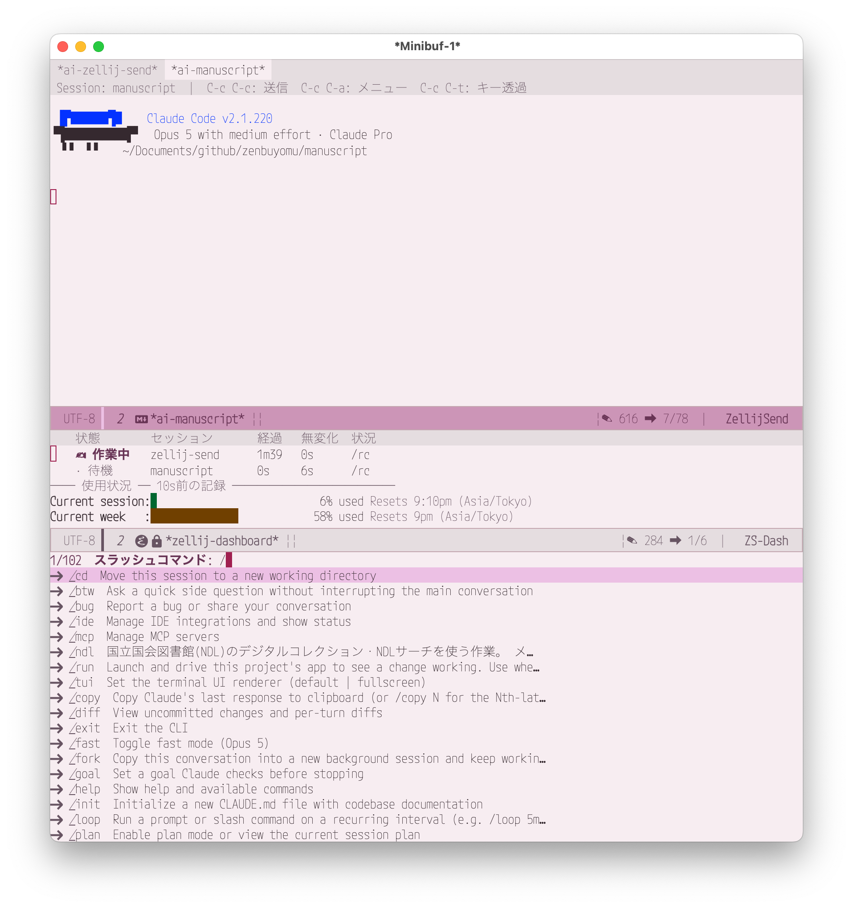
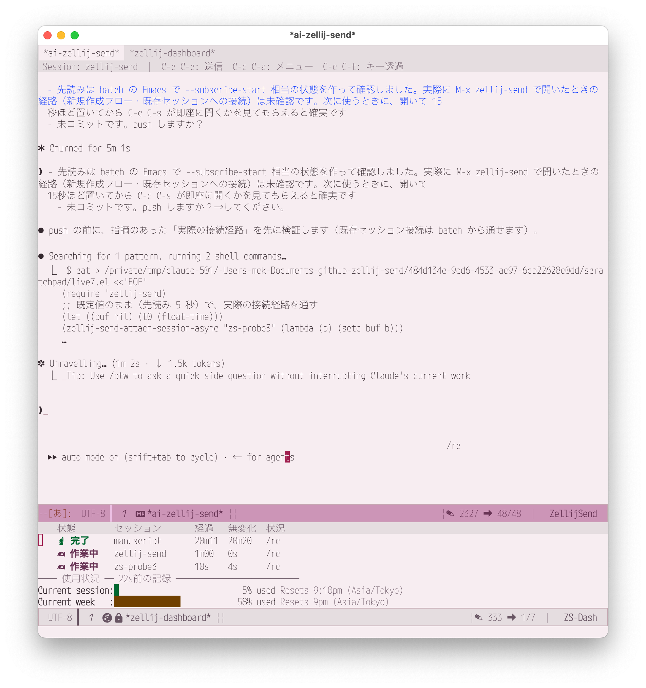

# zellij-send.el

[English](README.md) | 日本語

Emacs から detached の AI エージェントを運用する拡張です。
[zellij](https://zellij.dev/) のセッションひとつひとつが、書いて読むだけの普通の
Emacs バッファになります。Emacs の中にターミナルエミュレータは要りません。
attach するクライアントも、開いたままにしておく窓も要りません。

## 概要

`M-x zellij-send` で **detached** な zellij セッションを作り、ペインでエージェント
（既定は `claude`）を起動し、`*ai-セッション名*` バッファを黒板として渡します。
書いて `C-c C-c` で送ると、ペインの画面が同じバッファに返ってきます。


セッション名と必要なキーはヘッダ行に出ます。

何も attach していないので、開いたままにしておくものがありません。よそ見をしている
間もエージェントは動き続け、Emacs を再起動してもダッシュボードが動いている
セッションを勝手に拾い直します。同時に何本も走らせれば、どれが作業中で、どれが
終わっていて、どれが返事を待っているかを一覧で教えてくれます。

## なぜこのツール？

Emacs はあらゆるものがテキストであり、すべてのバッファが等価に存在するという
世界観で作られています。エージェントとの会話もテキストなら、それが編集している
ファイルも、いま下書きしている文章も、1 時間前に言ったことのログもテキストです。
エージェントをバッファに置くということは、開いている他のすべてと同じ世界に
置くということで、これはある働き方に向いています。

> Emacs はあらゆるものがテキストであるという一貫性があり、すべてのバッファが
> 等価に存在するという世界観で作られているので、「様々な場所にあるファイルを開き、
> 気が向いた作業をちょろちょろしながら過集中が起きるのを待つ」という人には向いている。

目指しているのはこれです。あなたが眺めている横で勝手にコードを書く IDE ではなく、
片方のバッファでエージェントにソフトウェアを作らせながら、もう片方では別の
エージェントに文章の下書きを手伝わせ、注意が向いたほうへ移っていくための作業台。
やろうと思えば複雑なこともできますが、要は**ちょろちょろするコストが低いこと**が
主眼です。

そこから出てくる性質:

- **エージェントは窓より長生きする。** セッションは
  `zellij attach --create-background` で作り、pane-id を指定して操作するので、
  ターミナルのクライアントは一度も必要ありません。フレームを閉じても、Emacs を
  再起動しても、翌日でも、直接見たくなったらターミナルで `zellij attach` すれば
  同じセッションがそこにあります。
- **同時に何本も、が普通の使い方。**
  [ダッシュボード](#ダッシュボードzellij-send-dashboardel)が全セッションの状態、
  その状態でいる時間、画面が最後に変化してからの時間を並べるので、詰まっているものが
  訪ねなくても分かります。
- **文章を作るのはターミナルではなく Emacs。** 普通のバッファで書けるので、
  インプットメソッドも、abbrev もスニペットも、他のバッファからのヤンクも効きます。
  送る前に何度でも推敲できます。
- **会話がバッファである。** 検索でき、保存でき、他へ渡せます。`C-c C-a` → `a` は
  Claude Code の transcript から会話を丸ごと組み直すので、画面から流れて消えた分も
  失われません。

### `vterm` / `eat` でインプットメソッドが壊れる人へ

これがこの拡張ができた元々の理由で、当てはまる人にとっては今も一番鋭い理由です。

`vterm` や `eat` などの Emacs ターミナルエミュレータは、キー入力を子プロセスに
そのまま渡します。TUI を動かすにはそれが正しいのですが、その結果
**Emacs の中で動くインプットメソッドはキーを見る機会が一度もありません**。
「うまく動かない」のではなく、そもそも走らない。`shell-mode` や `eshell` なら
インプットメソッドは生きていますが、Claude Code のようなインタラクティブな TUI は
動かせません。

問題の形に注意してください。OS 側の IME（macOS、ibus、fcitx）は Emacs に届く前に
確定するので、`vterm` の中でもたいてい平気です。壊れるのは **Emacs 自身の入力**で、
同じ舟に乗っている人は思うより多くいます。

| | |
|---|---|
| 日本語 | [ddSKK](https://github.com/skk-dev/ddskk) — 変換処理が Emacs Lisp で走る |
| 中国語 | [`pyim`](https://github.com/tumashu/pyim)、[`emacs-rime`](https://github.com/DogLooksGood/emacs-rime) |
| ロシア語・ギリシャ語ほか | `C-\` と `russian-computer` など。**OS** のレイアウトを切り替えるとキーバインドが全滅するので、Emacs 側の入力メソッドが定石になっている |
| ベトナム語・インド系諸語 | 組み込みの Quail（`vietnamese-telex`、`devanagari-itrans` など） |
| 言語ですらないもの | `agda-input`、`lean4-input`、`TeX` メソッド。`\forall` と打って ∀ を出すのも同じ仕組み |

この表に入っているなら、対処は全員同じです。入力が効く普通の Emacs バッファで
文章を作り、TUI が機嫌よく動くペインへ zellij-send に届けさせる。

## 必要環境

- Emacs 28 以上（`transient` 内蔵）
- [zellij](https://zellij.dev/) **0.44 以上**がインストール済みで `$PATH` に通っていること（旧版は `dump-screen` の CLI 仕様が異なり、pane-id 指定もできません）
- [`markdown-mode`](https://github.com/jrblevin/markdown-mode)（オプション）：インストール済みの場合、マークダウン装飾が有効になります

## インストール

### 手動

`zellij-send.el` をロードパスに置き、`init.el` に追加します：

```elisp
(add-to-list 'load-path "/path/to/zellij-send")
(require 'zellij-send)
```

### use-package + elpaca（推奨）

```elisp
(use-package zellij-send
  :ensure (zellij-send
           :url "https://github.com/ichibeikatura/zellij-send.el"))
```

### 手動 use-package

```elisp
(use-package zellij-send
  :load-path "/path/to/zellij-send")
```

## 使い方

### 1. セッションを開く

```
M-x zellij-send
```

起動中の zellij セッション一覧が表示されます。選択すると `*ai-セッション名*` バッファが開きます。

`[New]` を選ぶと新規セッションを作成します。作業ディレクトリを聞かれ、ディレクトリ名がセッション名になります。zellij セッションは **detached（バックグラウンド）** で作られ、`zellij-send-default-command`（デフォルト: `claude`）が新しいペインで起動します。ペイン ID を記憶して送受信するため、ターミナルでの attach は不要です。途中経過を生で見たいときは任意のターミナルで `zellij attach セッション名` してください。

**既存セッション**（このパッケージ以外で作ったもの）はペイン ID が分からないため、フォーカス中のペインに送信します。この場合は attach 中のクライアント（ターミナル等）が必要です。完全に detached なセッションには入力が届きません。

### 2. テキストを送信

バッファにテキストを書いて `C-c C-c` で送信します。送信後バッファは自動的にクリアされます。

### 3. AI の回答を確認

Claude Code が回答を終えると、`*ai-セッション名*` バッファが**自動的に更新**されます。

バッファはペインを映しているので、見えるのは 1 画面分です。alt-screen の TUI には
スクロールバックが無いため、流れて消えた分はターミナル側にはもう残っていません。
会話を最初から読むには `C-c C-a` でメニューを開いて `a` を押してください。
Claude Code なら、Claude Code 自身が書いている transcript（JSONL）から会話を
組み直してバッファに流します。いまのペインの画面に戻して自動更新を再開するには
`g` を押します。

## キーバインド

`*ai-セッション名*` バッファ内で使えるキーバインドです。

| キー      | 動作                                   |
|-----------|----------------------------------------|
| `C-c C-c` | テキストを送信（バッファはクリア）     |
| `C-c C-a` | メニューを開く                         |
| `C-c C-k` | 処理を中断（Esc を送る）               |
| `C-c C-q` | 画面の質問に答える（AskUserQuestion）  |
| `C-c C-t` | キー透過モードの切り替え（キーがペインに届く） |
| `C-c C-s` | スラッシュコマンドを選んで送る（`C-u` で一覧を取り直す） |
| `M-p` / `M-n` | 送信済みのテキストを呼び戻す       |

### メニュー（`C-c C-a`）

**表示**

| キー | 動作                                                                 |
|------|----------------------------------------------------------------------|
| `d`  | ダッシュボード（全セッション一覧）を開く                             |
| `a`  | 会話を最初から表示（transcript から。`C-u a` は従来どおり画面をダンプ） |
| `g`  | いまの画面に戻す（取り直して自動更新を再開）                         |
| `l`  | 出力ログを開く（markdown。Stop フックが追記）                        |
| `x`  | バッファの内容をクリア                                               |

**送信**

| キー | 動作                                            |
|------|-------------------------------------------------|
| `e`  | 返信バッファを開く（AI の回答を読みながら返信） |
| `n`  | 数字を送る（入力プロンプトあり）                |
| `h`  | 送信履歴から選ぶ                                |
| `u`  | 画面の質問に答える（AskUserQuestion）           |
| `k`  | キー透過モード（↑↓ / RET / SPC がペインに届く） |

**命令**

| キー | 動作                                         |
|------|----------------------------------------------|
| `i`  | 処理を中断（Esc を送る）                                               |
| `/`  | スラッシュコマンドをミニバッファで選んで送る（`/compact`・`/clear` もここから） |
| `s`  | 作業内容を `CLAUDE.md` に記録するよう依頼                              |
| `q`  | セッションを削除（zellij セッションを消してバッファを閉じる。確認あり） |

### 送信履歴

送信したテキストはセッションごとに記憶されます（`zellij-send-history-max`、既定 50）。`M-p` で遡り、`M-n` で戻ります。最新より先に戻ると、履歴を辿り始める前の下書きに復帰します。`C-c C-a` → `h` は補完で選べます。履歴は黒板バッファと返信バッファで共有され、どちらを閉じても残ります。

### スラッシュコマンド（`C-c C-s`）



`/compact` と `/clear` だけでなく、Claude Code のスラッシュコマンドを全部ミニバッファから選んで送れます。一覧はペイン自身の補完メニューから読み取るので、いま使えるコマンド（組み込み・スキル・プロジェクトのコマンド）とそのまま一致します。ミニバッファは `/` で始まっているので、続けて英字を打つと絞り込めます。`RET` で確定。

引数を取るコマンド（`/effort`、`/model`、`/add-dir` など）は確定後に引数を尋ねます。`low|medium|high|…` のように選択肢が決まっているものは補完候補になり、それ以外は自由入力です。引数を取らないコマンドはそのまま送ります。

一覧の取得には数秒かかります（実測 102 件で約 8〜10 秒）が、**黒板バッファを開いた数秒後に裏で先読みしておく**ので、実際に `C-c C-s` を押す頃には待ち時間はありません。取った一覧は**作業ディレクトリごとに共有**するので、同じプロジェクトの 2 つ目以降のセッションは取得ゼロで開けます。スキルやプロジェクトのコマンドを足したら `C-u C-c C-s` で取り直してください。先読みが邪魔なら `zellij-send-slash-prefetch` を `nil` に。

取得はペインの入力欄を実際に打って行うため、**入力欄に書きかけのテキストがあるときは何もしません**。取得の途中でターミナル側から打ち始めた場合もその場で中止します（どちらも下書きを消さないため）。`/model` や `/config` のように送信後に対話画面が出るコマンドは、送るところまでを担当します。画面の操作はキー透過モード（`C-c C-t`）でどうぞ。

### 中断

`C-c C-k`（ダッシュボードでは `i`）でペインに `Esc` を送り、Claude Code の応答を止めます。状態を問わず実行できます。ダッシュボードの状態表示は数秒古いことがあり、「待機に*見える*」ことを理由に中断を拒むと止められなくなるためです。

### 返信バッファ（`C-c C-a` → `e`）

`*zellij-reply-セッション名*` バッファが開きます。AI の回答を `*ai-セッション名*` バッファで読みながら、返信を別バッファで書けます。

| キー      | 動作                                    |
|-----------|-----------------------------------------|
| `C-c C-c` | テキストを送信してバッファを閉じる      |

送信後は元のウィンドウ構成に自動的に戻ります。

### 会話を最初から読む（`C-c C-a` → `a`）

ペインが持っているのは 1 画面分だけで、送った長文は
`[Pasted text #1 +N lines]` に畳まれてしまうので、画面から会話を組み直すことは
できません。そこで `a` は Claude Code の transcript
（`~/.claude/projects/<slug>/` 以下の JSONL）を読み、会話を最初から黒板に流します。
あなたの発言、assistant の本文、thinking、ツールの呼び出しと結果を、すべて順番どおりに
出します。

transcript を表示している間はバッファを「クリア済み」扱いにするので、自動更新に
上書きされません。

### いまの画面に戻す（`C-c C-a` → `g`）

戻る側が `g` です。`dump-screen` でペインを取り直し、自動更新を再開します。
`a` で履歴を読んだ後だけでなく、**送るのをやめた下書きを書いた後**にも使います。
バッファを編集すると自動更新が止まる（上書きで下書きを失わないため）ので、
画面が固まったように見えるのはたいていこれです。中身のある下書きを捨てるときは
確認します。`C-u g` はスクロールバックまで含めて取ります（全画面 TUI 以外で意味が
あります）。

- Claude Code 以外のコマンドと `C-u a` は従来どおり zellij スクリーンをダンプします。
- transcript はプロジェクトディレクトリ内で**最終更新が最新のもの**を選ぶため、
  同じ作業ディレクトリで 2 セッション動かしていると取り違えることがあります。
- **画像は base64 のまま出しません**。ツールの結果に入っている画像は
  `[画像 image/png 66 KB]` の 1 行に置き換えます（元データは数 MB あり、
  読んでも意味がないため）。
- **1 行が長すぎるものは切ります**。`zellij-send-transcript-max-line-length`
  （既定 2000 文字）を超えた行は、そこで切って残りの文字数を添えます。
  ツールの入力は改行を持たない JSON で保存されるため、これが無いと
  `Write` 1 回で画面が埋まります。`nil` にすると切りません。
- ツールの出力が大きすぎてバッファが重いときは
  `zellij-send-transcript-max-block-lines` に行数を設定してください
  （既定は `nil` で、行数では省略しません）。

### 選択肢プロンプトへの応答

Claude Code が番号付き選択肢（`❯ 1.` 形式）を表示すると、`*ai-セッション名*` バッファが自動更新されて選択肢がハイライトされます。選択肢は `C-c C-a` → `n` で送信します。

### 質問への回答（AskUserQuestion / `C-c C-q`）

Claude Code が枠付きの質問（`❯ 1.` の選択肢・上部のタブ・最後の *Review your answers* 画面）を出したとき、ターミナルに移って矢印キーを叩く必要はありません。黒板バッファが既にペインの画面を映しているので、zellij-send はそこから質問を読み、ミニバッファで尋ね、対応するキーをペインに送ります。

- **単一選択** — 補完で選ぶと 1 打で確定し、Claude Code が次の質問へ自動で進みます
- **複数選択**（`multiSelect`）— `completing-read-multiple`（カンマ区切り）で複数選びます。状態を変える必要のある選択肢だけをトグルして確認画面まで進みます
- **自由入力**（`Type something`）— ミニバッファで入力した内容が欄に貼り付けられます
- **確認画面** — 送信前に `y/n` で尋ねます。`n` で取り消しです

既定では質問が出た瞬間にミニバッファが自動で開きます（`zellij-send-askq-auto`）。自分のタイミングで開きたければ `nil` にして `C-c C-q`（または `C-c C-a` → `u`）を使ってください。途中で `C-g` を押せば、ペインの質問はそのままで抜けられます。

### キー透過モード（`C-c C-t`）

生のキーを送りたいとき——権限ダイアログ、`/model` の選択、zellij-send が解釈しないメニュー——に使います。有効な間は ↑↓←→ / `RET` / `SPC` / `TAB` / `ESC` / `DEL` と印字文字が、バッファの編集ではなくペインへ送られます。ヘッダ行とモードライン（` →zellij`）で有効中と分かります。`C-c C-t`（メニューは `k`）か `C-g` で解除。有効中はバッファは read-only です（うっかり編集すると自動更新が止まり、画面が固まったように見えるため）。

## ダッシュボード（`zellij-send-dashboard.el`）

`M-x zellij-send-dashboard`（または `C-c C-a` → `d`）で、開いている全セッションを1つの表に並べます。要対応のものが上に来るよう並び替えられます。



| 列       | 意味                                                                  |
|----------|-----------------------------------------------------------------------|
| フラグ   | `✎` 未送信の下書きあり / `‖` クリア済み — ポーリング停止中で表示が古い |
| 状態     | 選択待ち / 完了 / 作業中 / 待機                                       |
| 経過     | その状態になってからの時間                                            |
| 無変化   | 画面が最後に変わってからの時間（詰まったセッションを見つけられる）    |
| 状況     | 画面末尾の意味のある行（スピナー行など）                              |

| キー        | 動作                              |
|-------------|-----------------------------------|
| `RET`       | そのセッションのバッファへ移動     |
| `o`         | 別ウィンドウに表示（一覧に留まる） |
| `e`         | そのセッションの返信バッファを開く |
| `1`/`2`/`3` | 選択肢を送信                       |
| `a`         | 画面を手動で取得                   |
| `l`         | そのセッションのログを開く         |
| `i`         | 処理を中断（Esc を送る）           |
| `c`         | `/compact` を送信                  |
| `r`         | Remote Control に接続して QR 表示  |
| `Q`         | セッションを終了（待機中のみ）     |
| `k`         | セッションを削除（状態を問わない） |
| `g`         | 手動更新（`revert-buffer`）        |
| `G`         | 未接続の zellij セッションに接続   |
| `?`         | キー一覧を表示                     |

キーは Emacs の作法に合わせてあります。`g` が更新（`revert-buffer-function` も差し替えてあるので `M-x revert-buffer` やマウス経由でも同じ更新になります）、その強い版の `G` が接続、`?` がキー一覧です。`?` は `*zellij-dashboard-help*` を開き、`q` で閉じます。`C-h m` でも一覧を見られます。

ダッシュボードを開くと、**まだバッファの無い起動中の zellij セッションすべてに自動接続します**（`zellij-send-dashboard-auto-connect`、既定 `t`）。何も尋ねません: 作業ディレクトリは `zellij action dump-layout` から、pane-id は `zellij action list-panes` から取得します（`zellij-send-default-command` と同名のタイトルのペインを優先、無ければ最初の端末ペイン）。pane-id が復元できるので、**Emacs を再起動した後でも attach クライアント無しで送信できます**。

接続は起動時だけでなく `zellij-send-dashboard-scan-interval` 秒ごと（既定 15 秒）にも行います。そのため **Emacs を起動したままターミナルで `zellij` を立ち上げても、放っておけば一覧に増えます**（すぐ欲しいときは `G`）。同時に、zellij 側で終了したセッションの黒板バッファは kill して行を消します（`zellij-send-dashboard-prune-gone`、既定 `t`）。ただし**編集中のバッファ（`buffer-modified-p`）は残します** — 書きかけの入力を失わないためです。`list-sessions` がタイムアウトしたときは「セッション 0 件」とはみなさず、行を消しません。`zellij` を呼ぶのはこの検出だけで、3 秒ごとの再描画はバッファ内容を読むだけです。

状態は各セッションバッファの内容から判定するため、**zellij を追加で呼びません**。「作業中」は、スピナー行（`zellij-send-dashboard-working-regexp`、既定 `esc to interrupt`）がある**か**、画面が `zellij-send-dashboard-active-window` 秒以内（既定 6 秒）に変化した場合です。この画面変化の判定が重要で、**Claude Code は本文を流している間スピナー行を出さない**ため、スピナーだけで見ていると回答中のセッションを「待機」と誤表示します。どちらも成り立たなくなると「完了」になり、そのバッファを表示した時点で解除されます。

`Q` は作業中・選択待ち・完了のセッションを拒否するので、キーの打ち間違いで作業中のセッションを落とすことはありません（`k` にはこの保護はありません）。

### Remote Control の QR（`r`）

`r` でカーソル行のセッションを [Remote Control](https://claude.ai/code) に接続し、QR コードを Emacs 上に表示します。スマホで読み取ればそのまま続きを操作できます。

QR は Claude Code 自身が半角ブロック文字で描くため、QR 生成器は不要です。ペインに `/remote-control` を送り、メニューが出るのを待って **Show QR code** を選び、画面を取り込み、`Esc` でオーバーレイを閉じてプロンプトに戻します。セッション URL も抽出してキルリングにコピーします。

ローカルのセッションを claude.ai 側に露出させる操作なので、`r` は必ず確認を求めます。またペインに文字を打ち込むため、`Q` と同じく**待機中のセッションでのみ**実行できます。

| 変数                                              | 意味                                       |
|---------------------------------------------------|--------------------------------------------|
| `zellij-send-dashboard-remote-control-timeout`    | 画面が出るまで待つ上限秒数（既定 40 秒）   |
| `zellij-send-dashboard-remote-control-poll`       | 待機中のポーリング間隔（既定 1.5 秒）      |

接続には 10 秒ほどかかるため、固定待ちではなくタイムアウト付きのポーリングにしてあります。QR は `*zellij-qr-セッション名*` バッファに **SVG 画像**として表示します。半角ブロック文字（`█`=上下 / `▀`=上 / `▄`=下）からモジュール行列を復元し、白地に黒の正方形＋4 モジュールの静穏帯で描き直します。文字のまま表示するとフォントの字形に左右されてまず読み取れません。大きさは `zellij-send-dashboard-qr-module-size`（1 モジュールのピクセル数、既定 4。33 モジュールで約 165px）で調整します。SVG が使えない環境ではテキスト版にフォールバックし、その場合はブロック文字の幅を 1 桁に矯正します。

既定では、ダッシュボードは現在のウィンドウの下に、内容ぴったりの高さで開きます（画面を占有しません）:

| 変数                                    | 意味                                                  |
|-----------------------------------------|-------------------------------------------------------|
| `zellij-send-dashboard-display-action`  | `display-buffer` のアクション（既定: 下部・高さ自動） |
| `zellij-send-dashboard-fit-window`      | 再描画のたびに高さを合わせる（既定 `t`）              |
| `zellij-send-dashboard-max-height`      | 高さの上限行数（既定 16）                             |
| `zellij-send-dashboard-tail-width`      | 「状況」列の幅（既定 40）                             |
| `zellij-send-dashboard-refresh-interval`| 再描画間隔・秒（既定 3。短すぎると行を選びにくい）    |
| `zellij-send-dashboard-scan-interval`   | セッション検出の間隔・秒（既定 15。0 で自動検出なし） |
| `zellij-send-dashboard-prune-gone`      | 消えたセッションの行を消す（既定 `t`）                |

`zellij-send-dashboard.el` を load-path に置く必要がありますが、`zellij-send.el` 本体はこれに依存しません。

### ダッシュボードに使用状況（`/usage`）を表示する

Claude Code の `/usage` と同じセッション/週の使用状況を表示できます:

表の下に、1 種別 1 行で表示します（高さは 3 行分。上のスクリーンショットを参照）。

バーはブロック文字（`█`）ではなく**空白に背景色**を付けて描いています。フォントによっては（M PLUS など）ブロック文字の字形が行の高さを超えてバーが崩れるためです。`zellij-send-dashboard-usage-bar-style` を `block` / `ascii` にすれば変更できます。

2 本のバーは使用率に応じた同じ色（緑・黄・赤）で描くため、使用率が近いと見分けが付きません。そこで 5 時間制限（`Current session`）のバーだけを 1 週間制限より少し薄く描いています（`zellij-send-dashboard-usage-light-ratio`。`0` で無効）。色相は変えていません——ここでの色は「制限にどれだけ近いか」を表すもので、どちらの制限かを表すものではないからです。

`/usage` は TUI 内でしか実行できず、`claude` CLI にも `usage` サブコマンドはありません。この情報を取得できる公式ルートは **statusLine コマンドの stdin に渡される JSON だけ**です。そこで、その JSON をキャッシュに保存するステータス行を設定し、ダッシュボードはそれを読むだけにします（追加プロセス・非公開 API なし）。

**1. `~/.claude/hooks/statusline-zellij-send.sh` を作成:**

```sh
#!/bin/sh
CACHE="$HOME/.claude/zellij-send-usage.json"
TMP="$CACHE.$$.tmp"

input=$(cat)

# rate_limits は API 応答から来るので、まだ 1 往復もしていないセッションが
# 渡す JSON には入っていない。キャッシュは全セッション共通の 1 ファイルで
# 最後に書いた者が勝つため、そのまま上書きすると直前まで出ていた使用状況が
# 消える。無いときだけ前回の値を引き継ぐ。引き継いだときは mtime も前回の
# ものに戻す（ダッシュボードは mtime を「◯前の記録」として表示するため）。
ZS_INPUT="$input" ZS_CACHE="$CACHE" ZS_TMP="$TMP" python3 - <<'PY' 2>/dev/null || printf '%s' "$input" > "$TMP" 2>/dev/null
import json, os

cache, tmp = os.environ["ZS_CACHE"], os.environ["ZS_TMP"]
new = json.loads(os.environ["ZS_INPUT"])
mtime = None

if not new.get("rate_limits"):
    try:
        with open(cache) as f:
            old = json.load(f)
        if old.get("rate_limits"):
            new["rate_limits"] = old["rate_limits"]
            mtime = os.path.getmtime(cache)
    except Exception:
        pass

with open(tmp, "w") as f:
    json.dump(new, f)
if mtime is not None:
    os.utime(tmp, (mtime, mtime))
PY

# 書いてから rename する（Emacs が書きかけを読まないように）
mv -f "$TMP" "$CACHE" 2>/dev/null
rm -f "$TMP" 2>/dev/null

# 何も出力しなければ TUI にステータス行は出ない（キャッシュは書かれるので
# ダッシュボードは動く）。ステータス行が欲しい場合はここで出力する:
#   printf '%s' "$input" | jq -r '"\(.model.display_name) | \(.workspace.current_dir)"'
exit 0
```

`chmod +x ~/.claude/hooks/statusline-zellij-send.sh`

**2. `~/.claude/settings.json` に登録:**

```json
{
  "statusLine": {
    "type": "command",
    "command": "/absolute/path/to/.claude/hooks/statusline-zellij-send.sh"
  }
}
```

反映には Claude Code の再起動が必要です。

上のスクリプトは何も出力しないので、Claude Code 側にステータス行は表示されません。フック自体は毎回呼ばれるため、キャッシュの更新には十分です。TUI にもステータス行が欲しい場合はここで出力してください。

キャッシュは動作中の Claude Code セッションが更新するため、ダッシュボードには読み取り時点の古さ（`12s前の記録`）を添えて表示します。レート制限は Claude サブスクリプションのアカウントで、かつセッションの最初の API 応答以降にのみ現れます。上のスクリプトが前回の値を引き継いでいるのはこのためで、起動したばかりのセッションが表示を消してしまうのを防いでいます。

| 変数                                     | 意味                                                        |
|------------------------------------------|-------------------------------------------------------------|
| `zellij-send-dashboard-show-usage`       | `nil` で使用状況を非表示（既定 `t`）                        |
| `zellij-send-dashboard-usage-file`       | キャッシュのパス（既定 `~/.claude/zellij-send-usage.json`） |
| `zellij-send-dashboard-usage-bar-width`  | バーの表示幅・桁（既定 24）                                 |
| `zellij-send-dashboard-usage-bar-style`  | `face` 背景色（既定）/ `block` █ / `ascii` `#`・`-`         |
| `zellij-send-dashboard-usage-light-ratio` | 5 時間制限のバーを薄くする度合い（既定 0.4。0 で 1 週間制限と同じ濃さ） |
| `zellij-send-dashboard-usage-timezone`   | タイムゾーン表記。`nil` なら `$TZ`、次に `%Z`               |

## カスタマイズ

`zellij` の実行ファイルのパスを変更する場合：

```elisp
(setq zellij-send-executable "/usr/local/bin/zellij")
```

Claude 出力ログの場所（セッション作業ディレクトリからの相対パス。フックスクリプト側と合わせること）:

```elisp
(setq zellij-send-log-file ".zellij-send/claude-log.md")
```

新しく作るセッションの大きさ（既定 320 桁 × 80 行）:

```elisp
(setq zellij-send-session-size '(320 . 80))  ; nil なら zellij 任せ
```

zellij は tty が無いとき環境変数 `COLUMNS` / `LINES` を見ます。Emacs のサブプロセスにはどちらも渡らないため、**この設定が無いと `attach --create-background` で作ったセッションは 25 桁 × 24 行**になります。Claude Code は自分でペイン幅に合わせて改行を入れて出力するので、狭いペインだと本文が細切れに折り返されて読めません。広く取っておけば長い行のまま届き、Emacs 側の幅で視覚的に折り返されます（`truncate-lines` が `nil` の場合）。

ターミナルから `zellij attach` すると、zellij の仕様でそのクライアントの大きさまでセッションが縮みます。広いまま使いたいときは attach しないでください。

## 自動受信 & markdown ログのセットアップ（Claude Code Stop フック）

Stop フックは Claude Code の回答完了のたびに 2 つの処理を行います:

1. **markdown ログ**: transcript から最新の assistant 出力を抽出し、作業ディレクトリの `.zellij-send/claude-log.md` に追記します（`C-c C-a` → `l` で開けます）。`~/.claude` の外に残るプロジェクト単位の記録です。いま進行中の会話を読み返すだけなら `C-c C-a` → `a` のほうが手軽です。
2. **自動受信**: `emacsclient` 経由で `*ai-セッション名*` バッファを更新します。こちらは Emacs server の起動が必要です（`(server-start)` または `emacs --daemon`）。

### 1. フックスクリプトを作成

`~/.claude/hooks/stop-zellij-send.sh` を作成します（`python3` が必要）:

```sh
#!/bin/sh
# ヒアドキュメントが stdin を占有するため、フックの JSON は環境変数で渡す
ZJS_HOOK_INPUT=$(cat)
export ZJS_HOOK_INPUT

/usr/bin/python3 - <<'PY' 2>/dev/null
import json, os, datetime

data = json.loads(os.environ.get("ZJS_HOOK_INPUT") or "{}")
transcript_path = data.get("transcript_path")
cwd = data.get("cwd") or ""

if transcript_path and cwd and os.path.isfile(transcript_path):
    last = None
    with open(transcript_path) as f:
        for line in f:
            try:
                rec = json.loads(line)
            except ValueError:
                continue
            if rec.get("type") != "assistant":
                continue
            msg = rec.get("message") or {}
            texts = [c.get("text", "")
                     for c in (msg.get("content") or [])
                     if isinstance(c, dict) and c.get("type") == "text"]
            text = "\n\n".join(t for t in texts if t.strip())
            if text.strip():
                last = text
    if last:
        log_dir = os.path.join(cwd, ".zellij-send")
        os.makedirs(log_dir, exist_ok=True)
        stamp = datetime.datetime.now().strftime("%Y-%m-%d %H:%M:%S")
        with open(os.path.join(log_dir, "claude-log.md"), "a") as out:
            out.write("\n## %s\n\n%s\n" % (stamp, last))
PY

# Emacs がビジー/フリーズしていても Stop フックをブロックしないよう、
# emacsclient はバックグラウンド起動して 10 秒で打ち切る
(
  emacsclient -e "(zellij-send--on-claude-stop)" >/dev/null 2>&1 &
  EC_PID=$!
  sleep 10
  kill "$EC_PID" 2>/dev/null
) &
exit 0
```

実行権限を付けます:

```sh
chmod +x ~/.claude/hooks/stop-zellij-send.sh
```

ログをコミットしたくない場合は `.zellij-send/` を `.gitignore`（またはグローバル gitignore）に追加してください。

### 2. Claude Code の設定ファイルを作成

`~/.claude/settings.json`（Claude Code のバージョンによってパスや形式が異なる場合があります）:

```json
{
  "hooks": {
    "Stop": [
      {
        "hooks": [
          {
            "type": "command",
            "command": "~/.claude/hooks/stop-zellij-send.sh"
          }
        ]
      }
    ]
  }
}
```

これで Claude Code が回答を終えるたびに `*ai-セッション名*` バッファが自動更新されます。

## トラブルシューティング

**「zellij セッションが見つかりません」と表示される**
- zellij が起動していることを確認してください。
- `zellij list-sessions` をターミナルで実行して出力があるか確認してください。
- `zellij-send-executable` に正しいパスが設定されているか確認してください（`M-x describe-variable RET zellij-send-executable`）。

**自動受信が動かない（バッファが更新されない）**
- Emacs server が起動しているか確認してください（`M-x server-start` または `emacs --daemon`）。
- `emacsclient -e t` をターミナルで実行して接続できるか確認してください。
- `~/.claude/hooks/stop-zellij-send.sh` に実行権限があるか確認してください（`chmod +x`）。

**日本語が文字化けする / 送信できない**
- `zellij action write-chars` は UTF-8 を前提としています。ターミナルのエンコーディングが UTF-8 になっているか確認してください。

## 仕組み

- 新規セッション: `zellij attach --create-background` で detached セッションを作成し、`zellij run --cwd DIR -- claude` でエージェントを新ペインで起動。返ってきたペイン ID を記憶して以後のコマンドに使う。attach クライアント（ターミナルエミュレータ）は不要
- テキスト送信: `zellij action write-chars --pane-id ID` でテキストを送り、`zellij action write --pane-id ID 13`（CR）で Enter を送信。ペイン ID 不明時はフォーカス中のペインに送る（attach クライアントが必要）
- 回答取得: `zellij action dump-screen` でペインの内容を標準出力に取得（zellij 0.44+）、ANSI エスケープを除去してバッファに表示
- 履歴の取得: ペインからは取れない（alt-screen にスクロールバックが無く、paste した本文はプレースホルダに畳まれる）ので、`C-c C-a` → `a` は Claude Code の transcript（JSONL）を直接読む
- **すべての zellij 呼び出しは非同期**（`make-process` + sentinel）で Emacs はブロックしない
- 自動受信（Stop フック）: Claude Code の Stop フック → 最新の assistant 出力を markdown ログに追記 → `emacsclient` → `zellij-send--on-claude-stop` → 全 zellij-send バッファを更新
- ポーリング: `zellij-send-poll-interval`（デフォルト 2 秒）間隔でスクリーン内容を取得・差分更新。ユーザーが入力中（`buffer-modified-p`）は更新しない
- 返信バッファ: `pop-to-buffer` で別ウィンドウに開き、送信後は `set-window-configuration` でウィンドウ構成を復元

## ライセンス

GPL v3 以降。詳細は [LICENSE](LICENSE) を参照してください。
