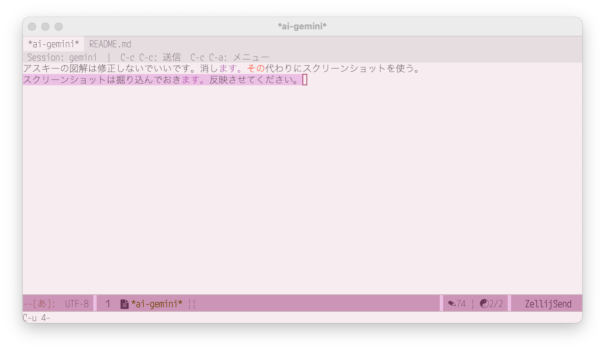

# zellij-send.el

[English](README.md) | 日本語

Emacs から [zellij](https://zellij.dev/) セッションの AI エージェント（Claude Code など）にテキストを送る Emacs 拡張です。

## 概要

`*ai-セッション名*` バッファを黒板として使い、テキストを書いて送信・AI の回答を取得・クリアを繰り返すシンプルなワークフローを提供します。



```
┌──────────────────────────────────────┐
│  Emacs: *ai-mysession*                │
│  ──────────────────────────────────  │
│  このコードの意図を説明して          │
│                                      │
│  C-c C-c → 送信 → バッファクリア     │
│  C-c C-a → メニュー                  │
└──────────────────────────────────────┘
         │ zellij action write-chars
         ▼
┌──────────────────────────────────────┐
│  zellij: mysession                   │
│  Claude Code が回答中...             │
└──────────────────────────────────────┘
```

## なぜこのツール？

`vterm` や `eat` などの Emacs ターミナルエミュレータは、キー入力を子プロセスに直接渡すため、ddSKK などの Emacs インプットメソッドが機能しません。

`shell-mode` や `eshell` ならインプットメソッドは使えますが、Claude Code のようなインタラクティブな TUI アプリケーションの実行には向いていません。

このツールはその問題を回避するための橋渡しです。通常の Emacs バッファ（インプットメソッドが使える）でテキストを書き、zellij セッション（TUI アプリが動く）に送信します。

## 必要環境

- Emacs 28 以上（`transient` 内蔵）
- [zellij](https://zellij.dev/) **0.44 以上**がインストール済みで `$PATH` に通っていること（旧版は `dump-screen` の CLI 仕様が異なり、pane-id 指定もできません）
- [`markdown-mode`](https://github.com/jrblevin/markdown-mode)（オプション）：インストール済みの場合、マークダウン装飾が有効になります

## インストール

### 手動

`zellij-send.el` をロードパスに置き、`init.el` に追加します：

```elisp
(add-to-list 'load-path "/path/to/zellij-send")
(require 'zellij-send)
```

### use-package + elpaca（推奨）

```elisp
(use-package zellij-send
  :ensure (zellij-send
           :url "https://github.com/ichibeikatura/zellij-send.el"))
```

### 手動 use-package

```elisp
(use-package zellij-send
  :load-path "/path/to/zellij-send")
```

## 使い方

### 1. セッションを開く

```
M-x zellij-send
```

起動中の zellij セッション一覧が表示されます。選択すると `*ai-セッション名*` バッファが開きます。

`[New]` を選ぶと新規セッションを作成します。作業ディレクトリを聞かれ、ディレクトリ名がセッション名になります。zellij セッションは **detached（バックグラウンド）** で作られ、`zellij-send-default-command`（デフォルト: `claude`）が新しいペインで起動します。ペイン ID を記憶して送受信するため、ターミナルでの attach は不要です。途中経過を生で見たいときは任意のターミナルで `zellij attach セッション名` してください。

**既存セッション**（このパッケージ以外で作ったもの）はペイン ID が分からないため、フォーカス中のペインに送信します。この場合は attach 中のクライアント（ターミナル等）が必要です。完全に detached なセッションには入力が届きません。

### 2. テキストを送信

バッファにテキストを書いて `C-c C-c` で送信します。送信後バッファは自動的にクリアされます。

### 3. AI の回答を確認

Claude Code が回答を終えると、`*ai-セッション名*` バッファが**自動的に更新**されます。

手動で取得する場合は `C-c C-a` でメニューを開き、`a` を押します。

## キーバインド

`*ai-セッション名*` バッファ内で使えるキーバインドです。

| キー      | 動作                                   |
|-----------|----------------------------------------|
| `C-c C-c` | テキストを送信（バッファはクリア）     |
| `C-c C-a` | メニューを開く                         |

### メニュー（`C-c C-a`）

**表示**

| キー | 動作                                                                 |
|------|----------------------------------------------------------------------|
| `d`  | ダッシュボード（全セッション一覧）を開く                             |
| `a`  | AI の回答を表示（zellij スクリーンをダンプ）                         |
| `l`  | 出力ログを開く（markdown。Stop フックが追記）                        |
| `x`  | バッファの内容をクリア                                               |

**送信**

| キー | 動作                                            |
|------|-------------------------------------------------|
| `e`  | 返信バッファを開く（AI の回答を読みながら返信） |
| `n`  | 数字を送る（入力プロンプトあり）                |

**命令**

| キー | 動作                                         |
|------|----------------------------------------------|
| `c`  | コンテキストを圧縮（`/compact`）                                       |
| `C`  | コンテキストをリセット（`/clear`）                                     |
| `s`  | 作業内容を `CLAUDE.md` に記録するよう依頼                              |
| `q`  | セッションを削除（zellij セッションを消してバッファを閉じる。確認あり） |

### 返信バッファ（`C-c C-a` → `e`）

`*zellij-reply-セッション名*` バッファが開きます。AI の回答を `*ai-セッション名*` バッファで読みながら、返信を別バッファで書けます。

| キー      | 動作                                    |
|-----------|-----------------------------------------|
| `C-c C-c` | テキストを送信してバッファを閉じる      |

送信後は元のウィンドウ構成に自動的に戻ります。

### 選択肢プロンプトへの応答

Claude Code が番号付き選択肢（`❯ 1.` 形式）を表示すると、`*ai-セッション名*` バッファが自動更新されて選択肢がハイライトされます。選択肢は `C-c C-a` → `n` で送信します。

## ダッシュボード（`zellij-send-dashboard.el`）

`M-x zellij-send-dashboard`（または `C-c C-a` → `d`）で、開いている全セッションを1つの表に並べます。要対応のものが上に来るよう並び替えられます。

```
   状態        セッション      経過   無変化  状況
 ❓ 選択待ち   proj-a          12s    3s     ❯ 1. Yes
 ☝ 完了       proj-b          1m04   1m04   完了 — 3 ファイル変更
 ✍ 作業中     proj-c          8s     0s     ✳ Frobnicating… (12s · esc to interrupt)
 · 待機       proj-d          5m21   5m21   ❯
```

| 列       | 意味                                                                  |
|----------|-----------------------------------------------------------------------|
| フラグ   | `✎` 未送信の下書きあり / `‖` クリア済み — ポーリング停止中で表示が古い |
| 状態     | 選択待ち / 完了 / 作業中 / 待機                                       |
| 経過     | その状態になってからの時間                                            |
| 無変化   | 画面が最後に変わってからの時間（詰まったセッションを見つけられる）    |
| 状況     | 画面末尾の意味のある行（スピナー行など）                              |

| キー        | 動作                              |
|-------------|-----------------------------------|
| `RET`       | そのセッションのバッファへ移動     |
| `o`         | 別ウィンドウに表示（一覧に留まる） |
| `e`         | そのセッションの返信バッファを開く |
| `1`/`2`/`3` | 選択肢を送信                       |
| `a`         | 画面を手動で取得                   |
| `l`         | そのセッションのログを開く         |
| `c`         | `/compact` を送信                  |
| `r`         | Remote Control に接続して QR 表示  |
| `Q`         | セッションを終了（待機中のみ）     |
| `k`         | セッションを削除（状態を問わない） |
| `g`         | 手動更新                           |
| `G`         | 未接続の zellij セッションに接続   |

ダッシュボードを開くと、**まだバッファの無い起動中の zellij セッションすべてに自動接続します**（`zellij-send-dashboard-auto-connect`、既定 `t`）。何も尋ねません: 作業ディレクトリは `zellij action dump-layout` から、pane-id は `zellij action list-panes` から取得します（`zellij-send-default-command` と同名のタイトルのペインを優先、無ければ最初の端末ペイン）。pane-id が復元できるので、**Emacs を再起動した後でも attach クライアント無しで送信できます**。

状態は各セッションバッファの内容から判定するため、**zellij を追加で呼びません**。「作業中」は Claude Code のスピナー行（`zellij-send-dashboard-working-regexp`、既定 `esc to interrupt`）で検出し、スピナーが消えると「完了」になります。「完了」はそのバッファを表示した時点で解除されます。

`Q` は作業中・選択待ち・完了のセッションを拒否するので、キーの打ち間違いで作業中のセッションを落とすことはありません（`k` にはこの保護はありません）。

### Remote Control の QR（`r`）

`r` でカーソル行のセッションを [Remote Control](https://claude.ai/code) に接続し、QR コードを Emacs 上に表示します。スマホで読み取ればそのまま続きを操作できます。

QR は Claude Code 自身が半角ブロック文字で描くため、QR 生成器は不要です。ペインに `/remote-control` を送り、メニューが出るのを待って **Show QR code** を選び、画面を取り込み、`Esc` でオーバーレイを閉じてプロンプトに戻します。セッション URL も抽出してキルリングにコピーします。

ローカルのセッションを claude.ai 側に露出させる操作なので、`r` は必ず確認を求めます。またペインに文字を打ち込むため、`Q` と同じく**待機中のセッションでのみ**実行できます。

| 変数                                              | 意味                                       |
|---------------------------------------------------|--------------------------------------------|
| `zellij-send-dashboard-remote-control-timeout`    | 画面が出るまで待つ上限秒数（既定 40 秒）   |
| `zellij-send-dashboard-remote-control-poll`       | 待機中のポーリング間隔（既定 1.5 秒）      |

接続には 10 秒ほどかかるため、固定待ちではなくタイムアウト付きのポーリングにしてあります。QR は `*zellij-qr-セッション名*` バッファに **SVG 画像**として表示します。半角ブロック文字（`█`=上下 / `▀`=上 / `▄`=下）からモジュール行列を復元し、白地に黒の正方形＋4 モジュールの静穏帯で描き直します。文字のまま表示するとフォントの字形に左右されてまず読み取れません。大きさは `zellij-send-dashboard-qr-module-size`（1 モジュールのピクセル数、既定 4。33 モジュールで約 165px）で調整します。SVG が使えない環境ではテキスト版にフォールバックし、その場合はブロック文字の幅を 1 桁に矯正します。

既定では、ダッシュボードは現在のウィンドウの下に、内容ぴったりの高さで開きます（画面を占有しません）:

| 変数                                    | 意味                                                  |
|-----------------------------------------|-------------------------------------------------------|
| `zellij-send-dashboard-display-action`  | `display-buffer` のアクション（既定: 下部・高さ自動） |
| `zellij-send-dashboard-fit-window`      | 再描画のたびに高さを合わせる（既定 `t`）              |
| `zellij-send-dashboard-max-height`      | 高さの上限行数（既定 16）                             |
| `zellij-send-dashboard-tail-width`      | 「状況」列の幅（既定 40）                             |
| `zellij-send-dashboard-refresh-interval`| 再描画間隔・秒（既定 3。短すぎると行を選びにくい）    |

`zellij-send-dashboard.el` を load-path に置く必要がありますが、`zellij-send.el` 本体はこれに依存しません。

### ダッシュボードに使用状況（`/usage`）を表示する

Claude Code の `/usage` と同じセッション/週の使用状況を表示できます:

```
── 使用状況 ─ 12s前の記録 ─────────────
Current session:███████▌               30% used Resets 6:40pm (Asia/Tokyo)
Current week   :███████▎               29% used Resets Jul 29 at 9pm (Asia/Tokyo)
```

表の下に、1 種別 1 行で表示します（高さは 3 行分）。

バーはブロック文字（`█`）ではなく**空白に背景色**を付けて描いています。フォントによっては（M PLUS など）ブロック文字の字形が行の高さを超えてバーが崩れるためです。`zellij-send-dashboard-usage-bar-style` を `block` / `ascii` にすれば変更できます。

`/usage` は TUI 内でしか実行できず、`claude` CLI にも `usage` サブコマンドはありません。この情報を取得できる公式ルートは **statusLine コマンドの stdin に渡される JSON だけ**です。そこで、その JSON をキャッシュに保存するステータス行を設定し、ダッシュボードはそれを読むだけにします（追加プロセス・非公開 API なし）。

**1. `~/.claude/hooks/statusline-zellij-send.sh` を作成:**

```sh
#!/bin/sh
CACHE="$HOME/.claude/zellij-send-usage.json"
TMP="$CACHE.$$.tmp"

input=$(cat)

# 書いてから rename する（Emacs が書きかけを読まないように）
printf '%s' "$input" > "$TMP" 2>/dev/null && mv -f "$TMP" "$CACHE" 2>/dev/null
rm -f "$TMP" 2>/dev/null

# 何も出力しなければ TUI にステータス行は出ない（キャッシュは書かれるので
# ダッシュボードは動く）。ステータス行が欲しい場合はここで出力する:
#   printf '%s' "$input" | jq -r '"\(.model.display_name) | \(.workspace.current_dir)"'
exit 0
```

`chmod +x ~/.claude/hooks/statusline-zellij-send.sh`

**2. `~/.claude/settings.json` に登録:**

```json
{
  "statusLine": {
    "type": "command",
    "command": "/absolute/path/to/.claude/hooks/statusline-zellij-send.sh"
  }
}
```

反映には Claude Code の再起動が必要です。

上のスクリプトは何も出力しないので、Claude Code 側にステータス行は表示されません。フック自体は毎回呼ばれるため、キャッシュの更新には十分です。TUI にもステータス行が欲しい場合はここで出力してください。

キャッシュは動作中の Claude Code セッションが更新するため、ダッシュボードには読み取り時点の古さ（`12s前の記録`）を添えて表示します。レート制限は Claude サブスクリプションのアカウントで、かつセッションの最初の API 応答以降にのみ現れます。

| 変数                                     | 意味                                                        |
|------------------------------------------|-------------------------------------------------------------|
| `zellij-send-dashboard-show-usage`       | `nil` で使用状況を非表示（既定 `t`）                        |
| `zellij-send-dashboard-usage-file`       | キャッシュのパス（既定 `~/.claude/zellij-send-usage.json`） |
| `zellij-send-dashboard-usage-bar-width`  | バーの表示幅・桁（既定 24）                                 |
| `zellij-send-dashboard-usage-bar-style`  | `face` 背景色（既定）/ `block` █ / `ascii` `#`・`-`         |
| `zellij-send-dashboard-usage-timezone`   | タイムゾーン表記。`nil` なら `$TZ`、次に `%Z`               |

## カスタマイズ

`zellij` の実行ファイルのパスを変更する場合：

```elisp
(setq zellij-send-executable "/usr/local/bin/zellij")
```

Claude 出力ログの場所（セッション作業ディレクトリからの相対パス。フックスクリプト側と合わせること）:

```elisp
(setq zellij-send-log-file ".zellij-send/claude-log.md")
```

## 自動受信 & markdown ログのセットアップ（Claude Code Stop フック）

Stop フックは Claude Code の回答完了のたびに 2 つの処理を行います:

1. **markdown ログ**: transcript から最新の assistant 出力を抽出し、作業ディレクトリの `.zellij-send/claude-log.md` に追記します（`C-c C-a` → `l` で開けます）。長いセッションの途中で過去の出力を確認するのに便利です。
2. **自動受信**: `emacsclient` 経由で `*ai-セッション名*` バッファを更新します。こちらは Emacs server の起動が必要です（`(server-start)` または `emacs --daemon`）。

### 1. フックスクリプトを作成

`~/.claude/hooks/stop-zellij-send.sh` を作成します（`python3` が必要）:

```sh
#!/bin/sh
# ヒアドキュメントが stdin を占有するため、フックの JSON は環境変数で渡す
ZJS_HOOK_INPUT=$(cat)
export ZJS_HOOK_INPUT

/usr/bin/python3 - <<'PY' 2>/dev/null
import json, os, datetime

data = json.loads(os.environ.get("ZJS_HOOK_INPUT") or "{}")
transcript_path = data.get("transcript_path")
cwd = data.get("cwd") or ""

if transcript_path and cwd and os.path.isfile(transcript_path):
    last = None
    with open(transcript_path) as f:
        for line in f:
            try:
                rec = json.loads(line)
            except ValueError:
                continue
            if rec.get("type") != "assistant":
                continue
            msg = rec.get("message") or {}
            texts = [c.get("text", "")
                     for c in (msg.get("content") or [])
                     if isinstance(c, dict) and c.get("type") == "text"]
            text = "\n\n".join(t for t in texts if t.strip())
            if text.strip():
                last = text
    if last:
        log_dir = os.path.join(cwd, ".zellij-send")
        os.makedirs(log_dir, exist_ok=True)
        stamp = datetime.datetime.now().strftime("%Y-%m-%d %H:%M:%S")
        with open(os.path.join(log_dir, "claude-log.md"), "a") as out:
            out.write("\n## %s\n\n%s\n" % (stamp, last))
PY

# Emacs がビジー/フリーズしていても Stop フックをブロックしないよう、
# emacsclient はバックグラウンド起動して 10 秒で打ち切る
(
  emacsclient -e "(zellij-send--on-claude-stop)" >/dev/null 2>&1 &
  EC_PID=$!
  sleep 10
  kill "$EC_PID" 2>/dev/null
) &
exit 0
```

実行権限を付けます:

```sh
chmod +x ~/.claude/hooks/stop-zellij-send.sh
```

ログをコミットしたくない場合は `.zellij-send/` を `.gitignore`（またはグローバル gitignore）に追加してください。

### 2. Claude Code の設定ファイルを作成

`~/.claude/settings.json`（Claude Code のバージョンによってパスや形式が異なる場合があります）:

```json
{
  "hooks": {
    "Stop": [
      {
        "hooks": [
          {
            "type": "command",
            "command": "~/.claude/hooks/stop-zellij-send.sh"
          }
        ]
      }
    ]
  }
}
```

これで Claude Code が回答を終えるたびに `*ai-セッション名*` バッファが自動更新されます。

## トラブルシューティング

**「zellij セッションが見つかりません」と表示される**
- zellij が起動していることを確認してください。
- `zellij list-sessions` をターミナルで実行して出力があるか確認してください。
- `zellij-send-executable` に正しいパスが設定されているか確認してください（`M-x describe-variable RET zellij-send-executable`）。

**自動受信が動かない（バッファが更新されない）**
- Emacs server が起動しているか確認してください（`M-x server-start` または `emacs --daemon`）。
- `emacsclient -e t` をターミナルで実行して接続できるか確認してください。
- `~/.claude/hooks/stop-zellij-send.sh` に実行権限があるか確認してください（`chmod +x`）。

**日本語が文字化けする / 送信できない**
- `zellij action write-chars` は UTF-8 を前提としています。ターミナルのエンコーディングが UTF-8 になっているか確認してください。

## 仕組み

- 新規セッション: `zellij attach --create-background` で detached セッションを作成し、`zellij run --cwd DIR -- claude` でエージェントを新ペインで起動。返ってきたペイン ID を記憶して以後のコマンドに使う。attach クライアント（ターミナルエミュレータ）は不要
- テキスト送信: `zellij action write-chars --pane-id ID` でテキストを送り、`zellij action write --pane-id ID 13`（CR）で Enter を送信。ペイン ID 不明時はフォーカス中のペインに送る（attach クライアントが必要）
- 回答取得: `zellij action dump-screen` でペインの内容を標準出力に取得（zellij 0.44+）、ANSI エスケープを除去してバッファに表示
- **すべての zellij 呼び出しは非同期**（`make-process` + sentinel）で Emacs はブロックしない
- 自動受信（Stop フック）: Claude Code の Stop フック → 最新の assistant 出力を markdown ログに追記 → `emacsclient` → `zellij-send--on-claude-stop` → 全 zellij-send バッファを更新
- ポーリング: `zellij-send-poll-interval`（デフォルト 2 秒）間隔でスクリーン内容を取得・差分更新。ユーザーが入力中（`buffer-modified-p`）は更新しない
- 返信バッファ: `pop-to-buffer` で別ウィンドウに開き、送信後は `set-window-configuration` でウィンドウ構成を復元

## ライセンス

GPL v3 以降。詳細は [LICENSE](LICENSE) を参照してください。
